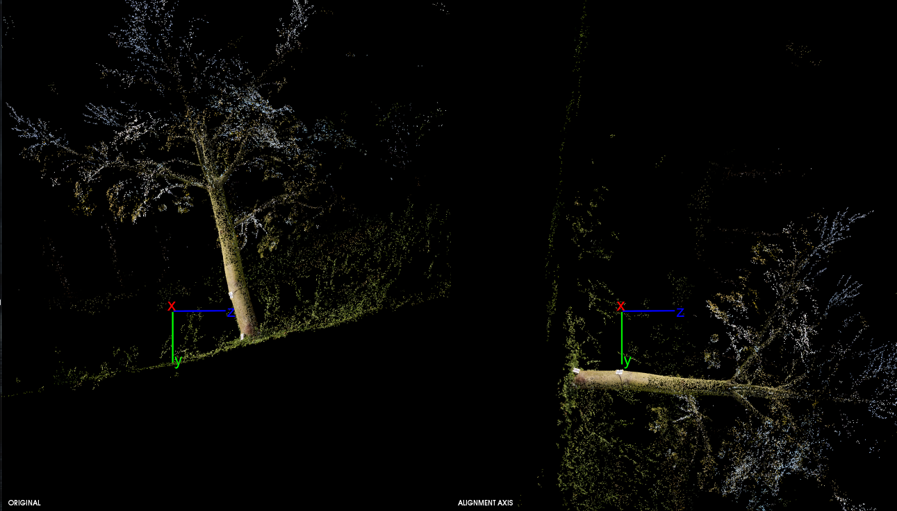

# align_pointcloud
Alignment between the coordinate system of a point cloud and the global coordinate system of pcl. Using the dot product and the cross product, a normal plane vector is extracted from the point cloud using the NormalEstimation Method. Then, a normal plane XYZ vector (x = 0, y = 0, z = 1). Finally, a rotation matrix is obtained from a rotation vector (axis of rotation) and an angle of rotation.

----------------------
## Input file structure support

* .pcd 
* .ply

## Example

 

## Compile
* Set "YOUR" PCL Build DIR in CMakeList.txt e.g: **/opt/pcl-1.8.1/build** and save it. (support pcl 1.9.1)
* Create a "build" folder

in the main folder:

	cd /build  
	cmake ../
    	make
       
        	 
### Test

	cd /build
	./alignmentCloud <pcd file> 
  	./alignmentCloud <ply file> 

